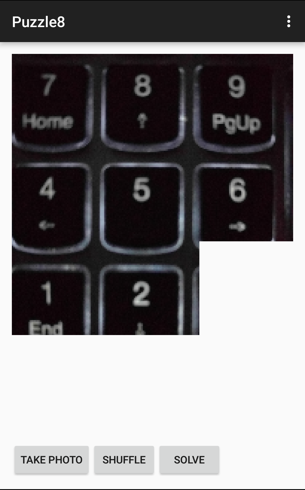
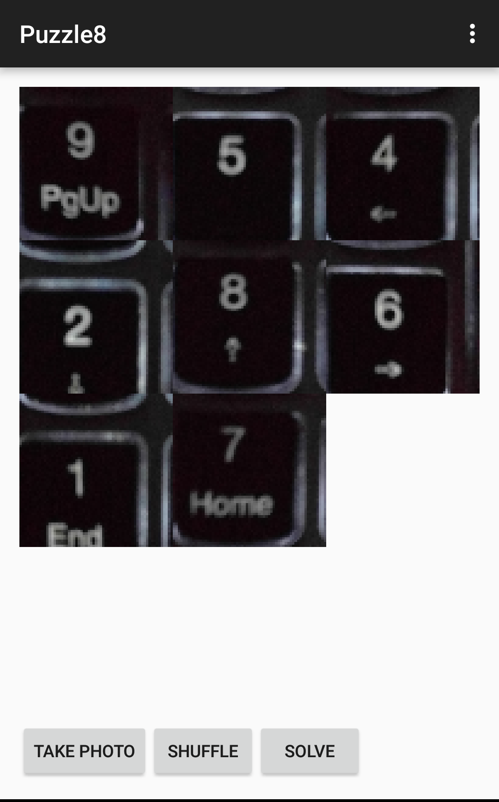

# Puzzle 8
  

This is an android app that creates a 3x3 (8 tiles) sliding puzzle out of pictures you take using your android phone. On creating the puzzle you can tap on shuffle to shuffle the tiles. If you aren't able to solve this puzzle, tap the solve button and see the app solve this puzzle for you using A* search algorithm.

## Requirements
* Android SDK
* Android Studio
